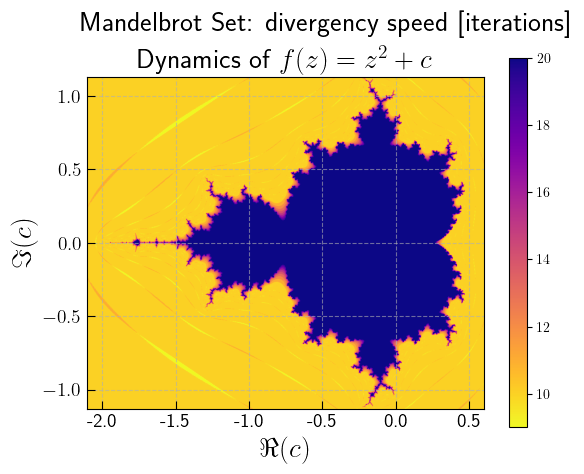

.. PyMandelbrot documentation master file, created by
   sphinx-quickstart on Fri Apr 22 14:56:30 2022.
   You can adapt this file completely to your liking, but it should at least
   contain the root `toctree` directive.

Welcome to PyMandelbrot's documentation!
========================================

.. image:: https://img.shields.io/badge/CERN-Open%20Source-%232980b9.svg
   :target: https://home.cern

.. image:: https://img.shields.io/badge/CERN-CERN%20openlab-brightgreen
   :target: https://openlab.cern/

.. toctree::
   :maxdepth: 2
   :caption: Contents:

   introduction

.. toctree::
   :maxdepth: 2
   :caption: API:

   modules

Indices and tables
******************

* :ref:`genindex`
* :ref:`modindex`
* :ref:`search`

