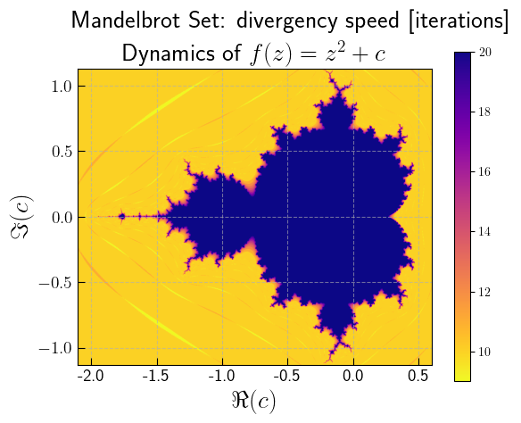

# Examples folder

This folder contains basic examples of the `PyMandelbrot` package usage.

## Plot example

Both [plot_example.py](plot_example.py) and [plot_example.ipynb](plot_example.ipynb)
files contain the code to reproduce the following picture:

It represents the Mandelbrot set. The colorbar represents the speed of divergence,
measured as the number of iterations needed for `f(z)` to exceed a certain threshold.
